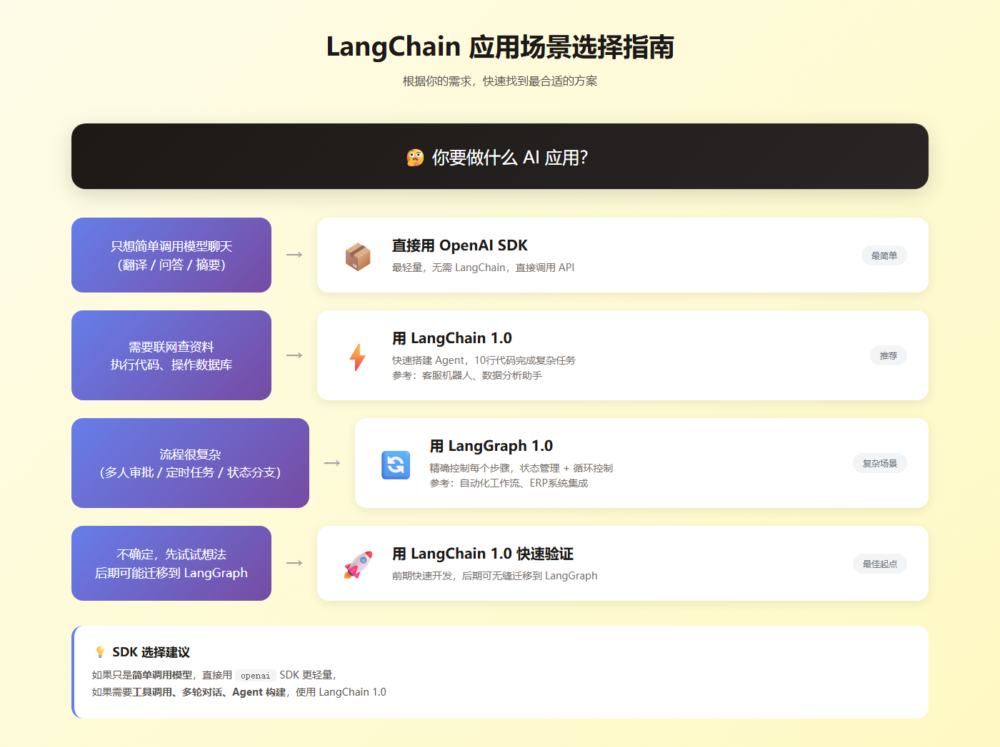
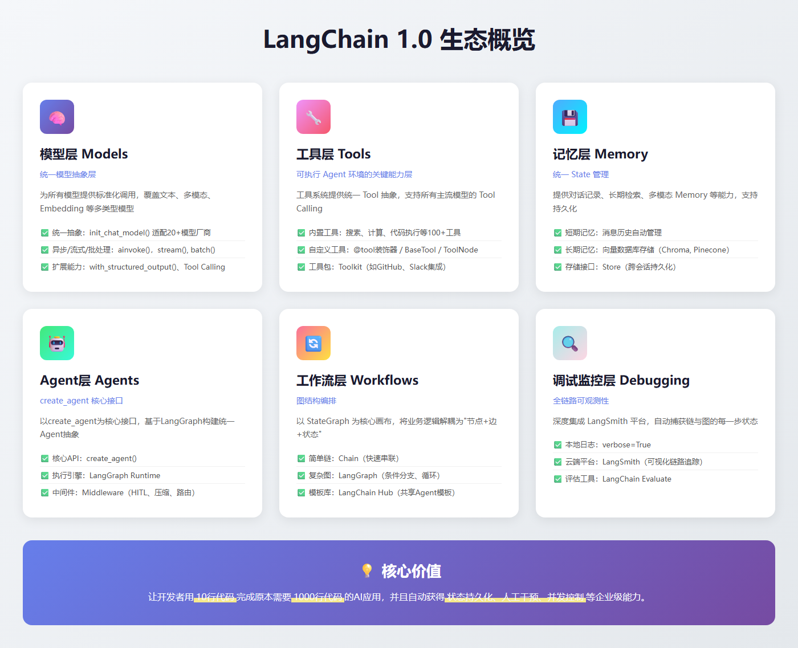
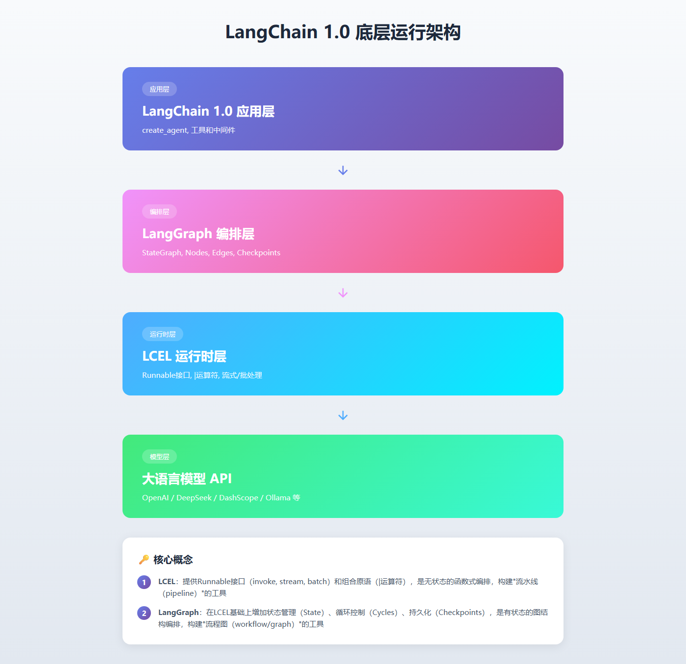
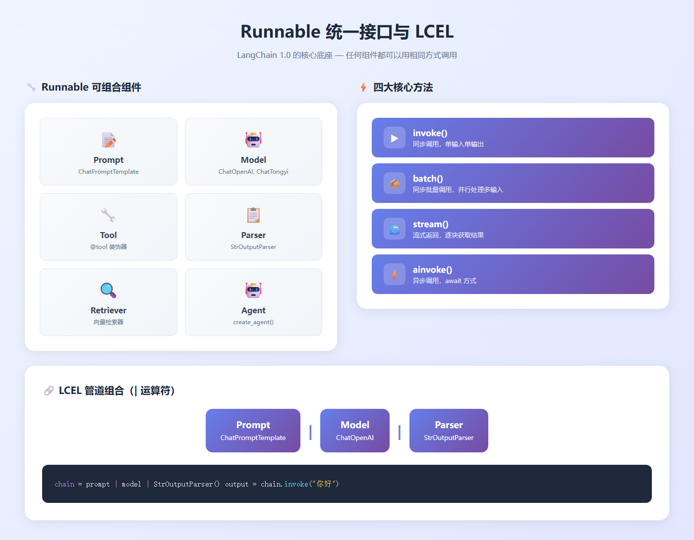

## <center>第一阶段、LangChain 框架介绍</center>

&emsp;&emsp;LangChain 是一个**构建 LLM 应用的框架**，目标是把 LLM 与外部工具、数据源和复杂工作流连接起来 —— 支持从简单的 prompt 封装到复杂的 Agent（能够调用工具、做决策、执行多步任务）。它不仅仅是对LLM API的封装，而是提供了一套完整的工具和架构，让开发者能够更轻松地构建**上下文感知**和**具备推理能力**的AI应用。LangChain 1.0 版本把“Agent 的稳定化、结构化输出、可观测性与生产化”作为核心改进目标。

### 1.1 用 LangChain 能做什么？


- 构建 Retrieval-Augmented Generation（RAG）问答系统

- 把 LLM 当作“Agent”去调用外部 API（搜索、数据库、文件系统）并返回任务结果

- 组织 prompt → 模型 → 后处理 的可复用流水线（Chains）

- 实现多轮对话带记忆（Memory）与长会话管理

- 在生产中管理可观测性与评估（配合 LangSmith/LangGraph）

&emsp;&emsp;**核心价值**：让开发者用**10行代码**完成原本需要1000行代码的AI应用，并且自动获得**状态持久化、人工干预、并发控制**等企业级能力。

&emsp;&emsp;1.0 的架构风格可以用一句话概括:以“**统一智能体抽象 + 标准化内容表示 + 可插拔治理中间件**”为设计骨干,以 LangGraph 为底座运行时,实现“开发简单性”与“生产可控性”的兼顾。它一方面通过 create_agent 提供低门槛的构建入口,另一方面保留足够的钩子点与下探能力,以满足复杂工作流与高标准治理的需求。

```plain
你要做什么AI应用？
│
├─ 只想简单调用模型聊天（翻译/问答）
│   └─> 直接用OpenAI SDK（更轻量，无需LangChain）
│
├─ 需要联网查资料、执行代码、操作数据库
│   └─> 用LangChain 1.0（快速搭建Agent）
│       └─> 参考：客服机器人、数据分析助手
│
├─ 流程很复杂（多人审批/定时任务/状态分支）
│   └─> 用LangGraph 1.0（精确控制每个步骤）
│       └─> 参考：自动化工作流、ERP系统集成
│
└─ 不确定，先试试想法
    └─> 用LangChain 1.0快速验证，后期可无缝迁移到LangGraph
```



**图解说明**：根据应用场景选择合适的方案 — 简单调用用SDK，需要Agent用LangChain，复杂流程用LangGraph

### 1.2 LangChain 生态概览



**图解说明**：LangChain 1.0 六大核心模块 — 模型层、工具层、记忆层、Agent层、工作流层、调试监控层 

#### 模型层（Models）

LangChain 1.0 的统一模型抽象层，为所有模型提供标准化调用，覆盖文本、多模态、Embedding、Rerank 等多类型模型，实现跨供应商一致体验

- 统一抽象：init_chat_model() 适配20+模型厂商

- 异步/流式/批处理：ainvoke()，stream(), batch()

- 执行方式：完全兼容 LCEL 与 LangGraph

- 扩展能力：with_structured_output()、Tool Calling、多模态 Content Blocks


#### 工具层（Tools）

工具系统提供统一 Tool 抽象，支持所有主流模型的 Tool Calling，深度集成 LangGraph，构建可执行 agent 环境的关键能力层

- 内置工具：搜索、计算、代码执行等100+工具

- 自定义工具：@tool装饰器 / BaseTool / ToolNode

- 工具包：Toolkit（如GitHub、Slack集成）

#### 记忆层（Memory）

记忆层提供统一 State 管理、对话记录、长期检索、多模态 Memory 等能力，支持持久化与复杂工作流状态流转

- 短期记忆：消息历史自动管理 

- 长期记忆：向量数据库存储（Chroma, Pinecone）

- 存储接口：Store（跨会话持久化）

#### Agent层（Agents）

LangChain 1.0 Agents系统实现从碎片化到标准化升级，以create_agent为核心接口，基于LangGraph构建统一Agent抽象，10行代码即可创建基础Agent，封装"模型调用→工具选择→执行→结束"闭环流程

- 核心API：create_agent() 

- 执行引擎：LangGraph Runtime（自动持久化）

- 中间件：Middleware（HITL、压缩、路由）

#### 工作流层（Workflows）

Workflows 体系实现从 线性链式（Chain）到图结构（Graph） 的范式转移，以 StateGraph 为核心画布，将业务逻辑解耦为 "节点（Node）+ 边（Edge）+ 状态（State）"，原生支持循环（Loop）与条件分支，完美适配复杂任务编排、容错重试及长会话保持。

- 简单链：Chain（快速串联）

- 复杂图：LangGraph（条件分支、循环）

- 模板库：LangChain Hub（共享Agent模板）

#### 调试监控层（Debugging）

LangChain 1.0 调试监控层实现了从 日志黑盒到全链路可观测性（Observability） 的质变，深度集成 LangSmith 平台，自动捕获链（Chain）与图（Graph）的每一步骤状态、Token 消耗及延迟，支持"Trace → Playground"一键回放调试，彻底解决复杂 Agent 逻辑难以排查的痛点。

- 本地日志：verbose=True

- 云端平台：LangSmith（可视化链路追踪）

- 评估工具：LangChain Evaluate（效果评估）

#### 其他关键组件 (LangGraph & LangServe)

- **langgraph**: 这是一个底层的**Agent 调度框架** (Agent Runtime)，是一个相对“低级”（Low-level）的编排框架，它专注于解决复杂的“控制流”问题，用于构建健壮且有状态的多角色 LLM 应用程序。LangChain 1.0 中的新 Agents (通过 create_agent()) 就是建立在 LangGraph 之上的。

- **langserve**: 用于将任何 LangChain chain 或 agent **部署为 REST API** 的包，方便快速将应用投入生产环境。

### 1.3 LangChain 1.0 底层运行架构



**图解说明**：LangChain 1.0 四层架构 — 应用层 → LangGraph编排层 → LCEL运行时层 → 大语言模型API

```python
# 简化版架构示意图
┌─────────────────────────────────────────┐
│        LangChain 1.0 应用层              │
│  (create_agent, 工具和中间件)            │
└──────────────────┬──────────────────────┘
                   │
                   ▼
┌─────────────────────────────────────────┐
│        LangGraph 编排层                  │
│  (StateGraph, Nodes, Edges, Checkpoints)│
└──────────────────┬──────────────────────┘
                   │
                   ▼
┌─────────────────────────────────────────┐
│        LCEL 运行时层                     │
│  (Runnable接口, |运算符, 流式/批处理)    │
└──────────────────┬──────────────────────┘
                   │
                   ▼
┌─────────────────────────────────────────┐
│        大语言模型API(OpenAI/DeepSeek)    │
└─────────────────────────────────────────┘```

* LCEL：提供Runnable接口（invoke, stream, batch）和组合原语（|运算符），是无状态的函数式编排，构建“流水线（pipeline）”的工具

* LangGraph：在LCEL基础上增加状态管理（State）、循环控制（Cycles）、持久化（Checkpoints），是有状态的图结构编排，构建“流程图（workflow/graph）”的工具

### 1.4 Runnable底层执行引擎



**图解说明**：Runnable 统一接口 — 所有组件（Prompt、Model、Tool、Parser等）都支持 invoke/batch/stream/ainvoke 四大方法；LCEL 使用 | 运算符组合组件

Runnable 是 LangChain 1.0 的“统一接口标准”，任何可以运行的组件——模型、Prompt、工具、解析器、Memory、Graph 节点——在 1.0 中都被抽象为 Runnable。

Runnable 使所有 LangChain 组件能够以统一接口组合、执行、链式调用，并支撑 LCEL（LangChain Expression Language）的整个运行语义，支撑可组合、可并行、可路由的链式执行，是 LangChain 1.0 的核心底座之一。

核心思想：Runnable 抽象与可组合链（Composable Chains）

* **LangChain 1.0** 将所有链式元素统一为 Runnable（执行模型）：

  - LLM（OpenAI、vLLM、Ollama……）

  - Prompt

  - Parser

  - Retriever

  - Tool

  - Agent

  - 自定义函数

所有对象都可以 .invoke()、.batch()、.stream()、.astream_events()，这实现了真正的统一调用接口。

* 工程价值：

  - 链路清晰。

  - 任意组件之间可无缝组合。

  - 所有执行方式（同步 / 异步 / 批处理 / 事件流）统一。

  - 这是 LangChain 1.0 最具革命性的改变，使其成为“模型调用管道”的事实标准。

#### Prompt Runnable

```python
from langchain_core.prompts import ChatPromptTemplate

# 1. 定义一个 Prompt (Runnable)
prompt = ChatPromptTemplate.from_template("Tell me a joke about {topic}")

# Prompt 也可以调用 invoke/stream
print(prompt.invoke({"topic": "ice cream"})) 
```

#### Tool Runnable

```python
from langchain_core.tools import tool

# 2. 定义一个简单的 Tool (Runnable)
@tool
def multiply(a: int, b: int) -> int:
    """Multiplies a and b."""
    return a * b

# Tool 也可以调用 invoke/batch
print(multiply.invoke({"a": 2, "b": 3})) 

# Tool 也可以调用 batch (自动并行)
print(multiply.batch([{"a": 2, "b": 3}, {"a": 4, "b": 5}]))
# 输出: [6, 20]```

#### **Runnable = LCEL 的语法基础**


LCEL（| 运算符）是由 Runnable 定义的组合语义：

```python
chain = prompt | model | StrOutputParser()
output = chain.invoke({"topic": "LangChain"})
```

这三者本质都是 Runnable：

```python
PromptTemplate   → Runnable
Model            → Runnable
Parser           → Runnable
```

任何 LCEL chain = 多个 Runnable 的组合。


| 技术                | 在 LangChain 1.0 的角色                         |
| ------------------- | ----------------------------------------------- |
| **LangChain**       | 构建 LLM + prompt + tool + outputparser 的组件生态 |
| **LangGraph**       | 构建 Agent / 多步工作流 / 状态机的框架          |
| **LCEL / Runnable** | LangChain 的底层执行引擎，依然核心              |


